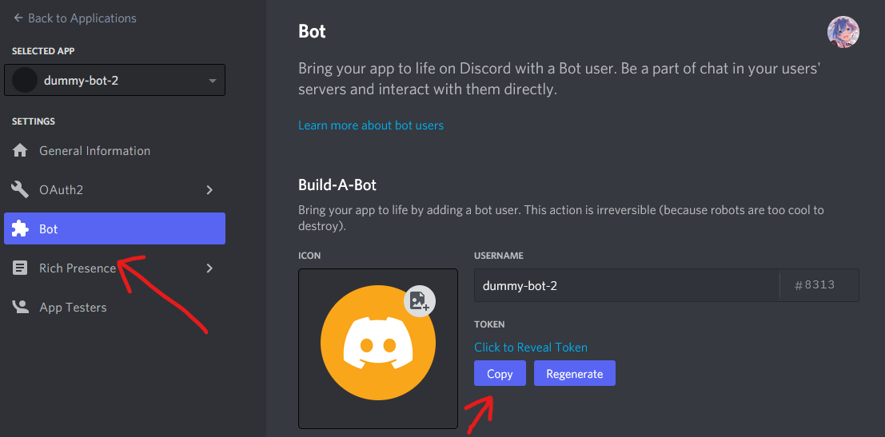

# Discord Dummy Bot

Discord Dummy Bot is a Discord Bot that performs simple tasks, similar to those normal users would on-demand such as:

- Joining voice channels
- Leaving voice channels
- Sending messages (coming soon)

## Adding to your Server

I am hosting three dummy bots myself to avoid dealing with the need to save you the hassle of self-hosting.

[dummy-bot-1](https://discord.com/oauth2/authorize?client_id=911029359534563339&permissions=8&scope=bot%20applications.commands)
[dummy-bot-2](https://discord.com/oauth2/authorize?client_id=911068573370290216&permissions=8&scope=bot%20applications.commands)
[dummy-bot-3](https://discord.com/oauth2/authorize?client_id=911069030566203412&permissions=8&scope=bot%20applications.commands)

> **Why Admin permissions?**
> Admin permissions allow the bot to view all channels. If this is not desired, the bot will function perfectly fine without admin permissions.

## Self-Hosting

### Requirements

- Python 3.7
- discord.py - 1.7.3 / [github](https://github.com/Rapptz/discord.py)
- PyNaCl - 1.4.0

### Setup

First, create a bot (or two) on the [Discord developer site](https://discord.com/developers/applications/) and get its token.



Second, install the dependencies:

```bash
pip3 install -r requirements.txt
```

Lastly, run the bot with as many tokens as you have:

```bash
DISCORD_TOKENS="token1 token2 token3" python3 ./dummy.py
```

**Tip**: You can add the bot to your Discord server by going to this URL (replace `APP_ID` with your Application ID): `https://discord.com/oauth2/authorize?client_id=APP_ID&permissions=8&scope=bot%20applications.commands`

#### Docker

Alternatively, you can run the bot inside a Docker container:

```bash
docker build -t dummybot_discord:latest
docker create -e "DISCORD_TOKENS=\"<tokens>\"" --name="dummybot" dummybot_discord:latest
docker start dummybot
```

## Commands

All commands need to begin by tagging the bot you wish to invoke:

- Use command `@<bot_name> join` to make the bot join you in a voice channel
- Use command `@<bot_name> leave` to make the bot leave their voice channel

## Credits

This project is a fork of [C. Nicolas's project](https://github.com/Eryux/dummybot-discord), with changes sublicensed under the GPL.

Notable changes include:

- Support for multiple bots through multi-threading
- Removed support for restricting who can use the bot
- Switched to using environment variables instead of hard-coded tokens

## License

GNU General Public License + MIT License

See [`LICENSE`](./LICENSE) for details.

The `LICENSE` file must be included in all reproductions of this software.
